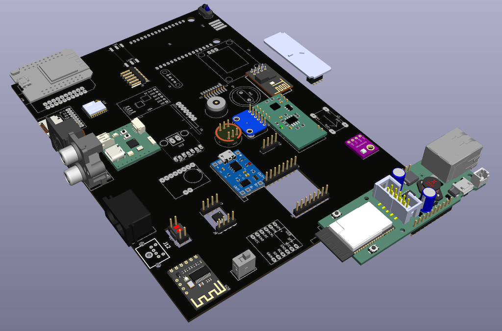

# Kicad Libraries

    git submodule add https://github.com/besi/kicad-esp8266             lib/esp8266
    git submodule add https://github.com/besi/kicad-tp4056              lib/tp4056
    git submodule add https://github.com/besi/kicad-lilygo-sim          lib/lilygo-sim
    git submodule add https://github.com/besi/kicad-relais-module       lib/relais-module
    git submodule add https://github.com/besi/kicad-esp-01m             lib/esp-01m
    git submodule add https://github.com/besi/kicad-radio-receiver      lib/radio-receiver
    git submodule add https://github.com/besi/kicad-dcdc                lib/dcdc
    git submodule add https://github.com/besi/kicad-schurter-switch     lib/schurter-switch
    git submodule add https://github.com/besi/kicad-mems-mic            lib/mems-mic
    git submodule add https://github.com/besi/kicad-neopixel-strip      lib/neopixel-strip
    git submodule add https://github.com/besi/kicad-ftdi-connector      lib/ftdi-connector
    git submodule add https://github.com/besi/kicad-c8-inlet            lib/c8-inlet
    git submodule add https://github.com/besi/kicad-rdm-6300            lib/rdm-6300
    git submodule add https://github.com/besi/kicad-magnetic-charger    lib/magnetic-charger
    git submodule add https://github.com/besi/kicad-sd-card             lib/sd-card
    git submodule add https://github.com/besi/kicad-adafruit-MAX98357   lib/adafruit-MAX98357
    git submodule add https://github.com/besi/kicad-lxb18               lib/lxb18
    git submodule add https://github.com/besi/kicad-rcj-22              lib/rcj-22
    git submodule add https://github.com/besi/kicad-midi                lib/midi
    git submodule add https://github.com/besi/kicad-esp32-wemos-d1-mini lib/esp32-wemos-d1-mini
    git submodule add https://github.com/besi/kicad-tcrt5000            lib/tcrt5000
    git submodule add https://github.com/besi/kicad-usb-a-pcb           lib/usb-a-pcb
    git submodule add https://github.com/besi/kicad-tcnd5000            lib/tcnd5000
    git submodule add https://github.com/besi/kicad-max98367            lib/max98367
    git submodule add https://github.com/besi/kicad-esp-01f             lib/esp-01f    
    git submodule add https://github.com/besi/kicad-bme280              lib/bme280
    git submodule add https://github.com/besi/kicad-m18                 lib/m18
    git submodule add https://github.com/besi/kicad-dd1718pa            lib/dd1718pa
    git submodule add https://github.com/besi/kicad-opb607a             lib/opb607a
    git submodule add https://github.com/besi/kicad-molex-poe           lib/molex-poe
    git submodule add https://github.com/besi/kicad-as12ap              lib/as12ap
    git submodule add https://github.com/besi/kicad-charge-module       lib/charge-module
    git submodule add https://github.com/besi/kicad-pts636              lib/pts636
    git submodule add https://github.com/besi/kicad-ld2450              lib/ld2450
    git submodule add https://github.com/besi/kicad-c3-pico             lib/c3-pico
    git submodule add https://github.com/besi/kicad-qwiic-adapter       lib/qwiic-adapter
    git submodule add https://github.com/besi/kicad-dcf77               lib/dcf77

Synchronise the git submodules

    git submodule update --init --recursive
